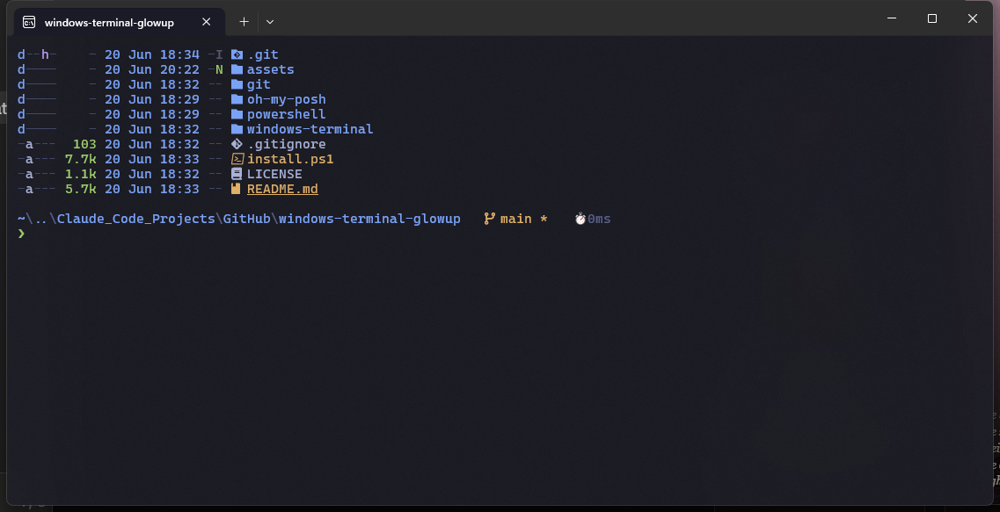

# windows-terminal-glowup

Turn a stock Windows Terminal + PowerShell into something you actually enjoy looking at — a themed two-line prompt, file icons, predictive autocomplete, a matching color scheme with transparency, and a set of modern CLI tools. One script, ~2 minutes.

> **Theme:** Tokyo Night · **Prompt:** Oh My Posh (two-line) · **Font:** CaskaydiaCove Nerd Font

<!-- Drop a screenshot at assets/preview.png and it'll show here -->
<!--  -->

```
~\my-project    main ↑1    ⬢ v20.11   ⏱ 42ms
❯
```

---

## Quick start

You need **Windows 10/11** with **Windows Terminal** and **winget** (both ship on Windows 11). Then:

```powershell
git clone https://github.com/trimmdev/windows-terminal-glowup.git
cd windows-terminal-glowup
powershell -ExecutionPolicy Bypass -File .\install.ps1
```

Want syntax-highlighted `git diff` too? Add `-ConfigureGitDelta`:

```powershell
pwsh -ExecutionPolicy Bypass -File .\install.ps1 -ConfigureGitDelta
```

When it finishes: **fully close Windows Terminal and open a new tab.** (The look only applies to newly opened tabs.) If you see ▯ boxes instead of icons, set the font to **CaskaydiaCove NF** in Settings → Defaults → Appearance.

The installer is **safe to re-run** and backs up anything it replaces (`*.bak-glowup`).

---

## What you get

### Look & feel
- **Oh My Posh** two-line prompt (path · git branch/status · Node/Python version · run time), green `❯` that turns red on errors
- **CaskaydiaCove Nerd Font** so all the glyphs render
- **Terminal-Icons** — file-type icons in `ls`/`dir`
- **Predictive autocomplete** — a dropdown of suggestions from history + a predictor plugin (PSReadLine)
- **Tokyo Night** color scheme, subtle acrylic transparency, comfy padding, block cursor
- **Visible scrollbar with command marks** — a tick per command so you can see/jump through your scrollback

### Modern CLI tools (installed via winget)
| You type | Tool | What it does |
|---|---|---|
| `ls` / `ll` / `la` / `lt` | [eza](https://github.com/eza-community/eza) | listings with icons + git status |
| `cat` | [bat](https://github.com/sharkdp/bat) | syntax-highlighted file viewer |
| `fd` | [fd](https://github.com/sharkdp/fd) | fast, friendly `find` |
| `rg` | [ripgrep](https://github.com/BurntSushi/ripgrep) | blazing-fast search |
| `git diff` | [delta](https://github.com/dandavison/delta) | side-by-side highlighted diffs *(opt-in)* |
| `lg` | [lazygit](https://github.com/jesseduffield/lazygit) | full git TUI |
| `btop` | [btop](https://github.com/aristocratos/btop4win) | gorgeous resource monitor |
| `cd` | [zoxide](https://github.com/ajeetdsouza/zoxide) | smart `cd` that learns your dirs |
| `Ctrl+R` | [fzf](https://github.com/junegunn/fzf) + PSFzf | fuzzy history / file search |
| `tldr` | [tealdeer](https://github.com/tealdeer-rs/tealdeer) | example-first command help |
| `sudo` | [gsudo](https://github.com/gerardog/gsudo) | elevate a single command |

### Shell helpers (in the profile)
`nt <name>` open a project in a **new tab** · `pj <name>` jump to a project · `gs` `gd` `gds` `gl` `lg` git shortcuts · `reload` re-source the profile · `..` / `...` up directories.

---

## Keybindings (Windows Terminal)

| Keys | Action |
|---|---|
| `Alt+1` … `Alt+9` | Jump to tab 1–9 |
| `Ctrl+Shift+F` | Find / search scrollback |
| `Ctrl+Alt+↑` / `↓` | Jump to previous / next command mark |
| `Ctrl+Alt+M` | Drop a scrollbar mark |
| `Ctrl+Alt+B` | Broadcast typing to all panes |
| `Alt+Shift+V` / `Alt+Shift+S` | Split pane vertical / horizontal |
| `Alt+Shift+U` | Duplicate pane |
| `Alt+←↑↓→` / `Alt+Shift+←↑↓→` | Move focus / resize panes |
| `Shift+F11` | Focus mode (hide tabs/title) |
| <code>Win+&#96;</code> | Quake-style drop-down terminal |
| `Alt+K` | Clear screen |

---

## What's in here

```
install.ps1                         one-command setup (idempotent, backs up)
powershell/
  Microsoft.PowerShell_profile.ps1  the profile (prompt, aliases, helpers)
oh-my-posh/
  two-line.omp.json                 the Oh My Posh theme
windows-terminal/
  color-scheme.tokyo-night.json     the color scheme
  profile-defaults.json             font / opacity / scrollbar defaults
  keybindings.json                  the keybindings above
git/
  delta.gitconfig                   optional delta diff config
```

Prefer to install by hand or cherry-pick? Each file is standalone — copy the theme to `%LOCALAPPDATA%\oh-my-posh\themes\`, the profile to your `$PROFILE`, and merge the `windows-terminal/*.json` pieces into your `settings.json`.

---

## Customizing

- **Less/more transparency:** change `opacity` (0–100) in `windows-terminal/profile-defaults.json`, or hold `Ctrl+Shift` and scroll in the terminal.
- **No startup banner:** comment out the `fastfetch` line near the bottom of the profile.
- **Different prompt segments/colors:** edit `oh-my-posh/two-line.omp.json` (see the [Oh My Posh docs](https://ohmyposh.dev/docs)).
- **Another theme:** browse [windowsterminalthemes.dev](https://windowsterminalthemes.dev) and swap the scheme.

## Undo

The installer backs up your previous `$PROFILE` and Windows Terminal `settings.json` as `*.bak-glowup` right next to the originals — rename them back to restore.

---

## Credits

Built on the work of [Oh My Posh](https://ohmyposh.dev), [Nerd Fonts](https://www.nerdfonts.com), [Terminal-Icons](https://github.com/devblackops/Terminal-Icons), [PSReadLine](https://github.com/PowerShell/PSReadLine), the [Tokyo Night](https://github.com/enkia/tokyo-night-vscode-theme) palette, and the excellent CLI tools linked above. MIT licensed — use it, fork it, share it.
